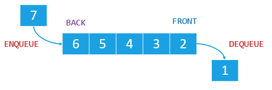

# Очередь. Абстрактный тип данных.

Этот абстрактный тип данных содержит набор элементов, которые добавляются в конец очереди и удаляются из начала очереди. \ 
Принцип упорядочивания очереди называется FIFO (Первым зашёл первым вышел).



Первый элемент, вставленный в очередь, будет первым элементом, удаленным из очереди. \

Queue и Stack похожи, но они следуют разным принципам, когда дело доходит до того, как манипулировать вставками и удалениями. \
Очередь - это известный принцип в нашей повседневной жизни, когда мы идем за покупками, нам нужно стоять в очереди к кассиру или врачу. \
Первый в очереди уходит первым, последний в очереди уходит последним. 

# Queue ADT
Интерфейс очереди может быть реализован по-разному, важно иметь операции для постановки в очередь нового элемента и удаления элемента из очереди: 
```
# Main operations
enqueue(element)         -> Добавить в конец очереди элемент
dequeue()                -> Удалить из очереди первый элемент
isEmpty()                -> Проверить очередь на пустоту
```
Поскольку абстрактные типы данных не определяют реализацию, это означает, что также неправильно говорить о временной сложности данного абстрактного типа данных. \

# Операции над очередью

Обход: Вы, должно быть, думаете: «Как я могу распечатать все элементы очереди?»
Очередь может быть пройдена, можно перемещаться по очереди, используя *dequeue* для исключения из очереди элемента, который нужно удалить из начала очереди, \ 
пока очередь не станет пустой. 
```
queue = Queue()
queue.enqueue(1)  # 1 добавлена в конец очереди
queue.enqueue(2)  # 2 добавлена в конец очереди
queue.enqueue(3)  # 3 добавлена в конец очереди
# в данный момент очередь выглядит следующим образом Queue(1, 2, 3)
    пока не queue.isEmpty() # пока очередь не пустая
        print queue.dequeue() # принти очередь
# Элементы будут выведены в порядке: 1-> 2 -> 3
```
# Реализация через список
```
package queue

import "fmt"

type Queue struct {
	Front *NodeQ
	Back  *NodeQ
}

type NodeQ struct {
	Data int
	Next *NodeQ
}

//O(1)
func Enqueue(q *Queue, data int) {
	new := &NodeQ{Data: data}
	if q.Front == nil {
		q.Front = new
		q.Back = new
		return
	}

	q.Back.Next = new
	q.Back = new
}

// o(1)
func Dequeue(q *Queue) *NodeQ {
	if q.Front == nil {
		fmt.Println("Empty Queue")
		return nil
	}
	front := q.Front
	// if q.Front.Next != nil {
	q.Front = q.Front.Next
	// }
	return front
}
```
# Зачем нужны очереди?
Когда вам не нужен доступ ко всем элементам входа не одновременно, а по очереди тогда следуют использовать очередь. \
Так как это ограничивает вас в возможности но при этом уменьшает количество возможных ошибок. \

Планировщики задач написаны на очередях.
