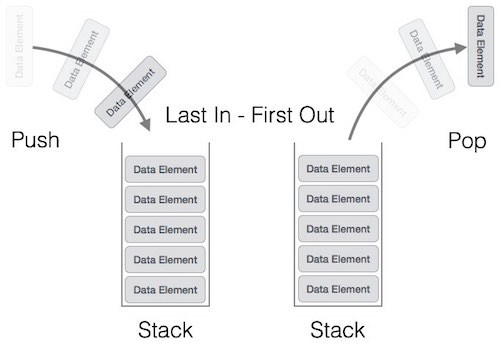

# Абстрактный тип данных
Абстрактный тип данных (АТД) — это математическая модель для типов данных, где тип данных определяется поведением (семантикой) с точки зрения пользователя. \
Абстрактные типы данных просто предоставляют минимальный интерфейс для управления структурой данных. \
Говоря проще АТД описывает какими методами и свойствами будет обладать структура данных.
# Структуры Данных
Структурой данных мы называем конкретную реализацию абстрактного типа данных. \
Мы можем анализировать временную сложность структуры данных и сколько памяти потребуется для её реализации. Структура данных может быть реализована несколькими способами.

# Стек как абстрактный тип данных
>Отличительная характеристика стека - добавление и удаление элементов происходит в одном конце структуры 

Стек хранит коллекцию элементов но в отличии от массива и связанного списка. \
мы имеем доступ только к концу стека. Этот конец часто называют top. \
Стек упорядочен по принципу LIFO (Последним зашёл Первым Вышел) 
Последний элемент который был положен в стек, будет первым удалён из стека. \
Можно представлять стек как куча лежащих друг на друге тарелок \


Интерфейс стека может быть имплементирован разными способами но важно иметь минимальный набор операций таких как push() isEmpty и pop().

```
func push(element) --> добавляет новый элемент в стек 
func isEmpty() bool --> проверяет стек на пустоту
func pop() *Node --> удаляет из стека самый верхний элемент
func peek() *Node --> даёт нам посмотреть на самый верхний элемент
```
Так как абстрактный тип данных не описывает конкретную имплементацию, будет неправильно анализировать как быстро будет работать АТД стек \
и сколько памяти он будет испольовать

# Стек операции
**Обход:** Вы наверное думаете как можно запринтить все элементы стека?
Можно запринтить все элементы стека используя pop() чтобы получать доступ ко всем верхним элементам попутно удаляя их из стека \
```
stack = Stack()
stack.push(1)  # 1 добавлен на верх стека
stack.push(2)  # 2 добавлен на верх стека
stack.push(3)  # 3 добавлен на верх стека

# Stack looks like = Stack(3, 2, 1)stack.peek()   

# 3 is the top element in the stack

while the is not stack.isEmpty()
    print stack.pop() 

# Элементы будут выведены в порядке: 3 -> 2 -> 1 
```
# Стек как структура данных 
Имплементация (конкретная реализация)
Стек может быть реализован по-разному. Через массивы или через связные списки. \
Мы рассмотрим обе реализации и решим которая из них лучше \
Если реализовывать через массивы мы должны хранить отдельно переменную top которая будет указывать на индекс самого верхнего элемента (не путать c len()-1)

```
package main

import "fmt"

type Stack struct {
    size int
    position int
    items []int
}

func newStack(size int) Stack {
    return Stack{position: -1, items: make([]int, size)}
}

func (stack *Stack) push(value int) {
    stack.position++
    stack.items[stack.position] = value;
}

func (stack *Stack) pop() int {
    value := stack.items[stack.position]
    stack.position--
    return value
}

func (stack Stack) isEmpty() bool {
    if stack.position >= 0 {
        return false
    }
    return true
}

func (stack Stack) top() int{
    return stack.items[stack.position]
}


func main() {
    stack := newStack(10)

    stack.push(1)
    stack.pop()

    stack.push(2)
    stack.push(3)
    stack.push(4)
    stack.push(5)

    for !stack.isEmpty(){
        value := stack.pop()
        fmt.Println(value);
    }

}
```

# Complexity

Cтек через массивы \
Время выполнения \
O(1) -> push \
O(1) -> pop \
Объём памяти - O(N)

# Стек через связные списки

```
package stack

type Stack struct {
	Top *Node
	Len int
}

// comment
type Node struct {
	Data int
	Prev *Node
}

func Push(s *Stack, data int) {
	new := &Node{Data: data}
	if s.Len == 0 {
		s.Top = new
		s.Len++
		return
	}
	new.Prev = s.Top
	s.Top = new
	s.Len++
}

func Pop(s *Stack) *Node {
	top := s.Top
	if s.Top.Prev != nil {
		s.Top = s.Top.Prev
	}
	return top
}

func Peek(s *Stack) int {
	return s.Top.Data
}
```

# Cложность стека через связные списки

Время выполнения: 
```
push O(1) 
pop O(1) 
peek O(1) 
isEmpty O(1) 
```
Объём памяти 
```
O(2N) = O(N)
```

# Зачем нужны стеки?

Нужно стараться быть минималистичным и подбирать самые подходящие алгоритмы и структуры при дизайне программ. \
Стек не обязательно хуже или лучше связных списков или тех же массивов. Они просто выполняют задачу \
Лучше иметь один хороший кухонный нож которым можно только нарезать овощи чем шведский складной нож, которым можно сделать всё \
но при этом он неудобный. Стек хорош тем что его тяжело сломать, так как у вас ограниченный доступ к инфорации которую он содержит. \
Особенно это заметно когда читаешь чужой код, становится сразу понятно зачем человек использует стек в то время как если бы использовался \
обычный массив, то вам бы пришлось много раз перечитать один и тот же блок кода, чтобы понять, что автор имел ввиду.

# Где можно использовать стек?

Ну начнём с того что задача Brackets из экзаменов очень легко решается через стек. 
Кнопка "Назад" в браузерах сделана через стек. \
оператор *defer* реализован также через стек. Ну и в конце концов стек памяти тоже реализован через стек. 